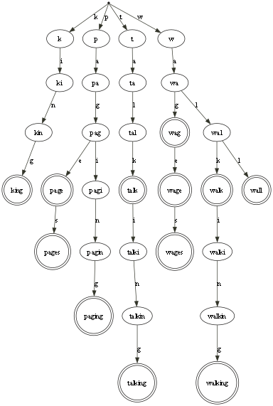
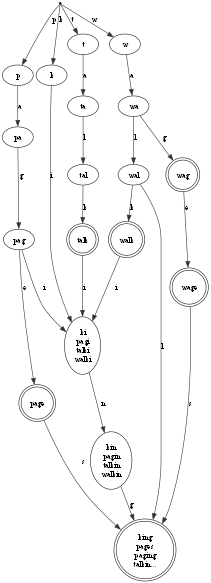

## Triex

String _trie_ matching using a ~~tree~~ DAG of processes (Elixir).

Triex provides full-string match of a word against a set of target tokens.
It does not implement sliding continuous search (grep, KMP, Aho-Corasick).

Triex is based on the idea of _Process Oriented Programming:_ 
* Algorithms are implemented using a fine-grain directed graph of 
  independent share-nothing processes.
* Processes communicate asynchronously by passing messages. 
* Process networks naturally run in parallel.

Triex does not store partial match values in the nodes,
so it can merge leaves into a single sink node, 
and share paths for some common suffixes
(i.e. single-link chains ending at the sink node, 
which do not contain intermediate final matches).

Usually a _trie_ is built as a prefix _tree_ (hence, the name).

_Triex builds a Directed Acyclic Graph (DAG) of process nodes._

Once the Triex process network is built, 
it runs asynchronously.
There can be many concurrent traversals of the network,
because all traversal state is held in the messages,
not stored in the process nodes.
Many input strings can be matched in parallel

_Triex_ match execution will naturally use all cores.

## Design

The trie is built as a DAG of independent processes.

Each process (node) has:
- Flag to indicate if it is a matching terminal state.
- Map of matching characters to the next (child) process 
  in the DAG (outgoing edges).
- A list of reverse edges back to parents 
  
Note that partial/final strings are not stored in the nodes:
nodes do not know the string or prefix that they match.
This allows the same node to match multiple input strings
by merging common suffixes into a DAG structure.

A list of reverse edges back to parents is maintained 
during construction, but is discarded before _freezing_
into runtime mode.

Traversals of the tree are implemented as a sequence of messages
propagating down one path within the DAG.

There are several phases of construction and use. 
- Construction has three types of traversal:
   - Traverse from the root to add all strings to form a tree
     of processes, but joined into a single final _sink_ node.
   - Traverse backwards from the final sink node to find common suffixes.
   - Traverse backwards from the sink to merge common suffixes.
   - Traverse from the root to _freeze_ the network.
- Match a target string by traversing from the root.
- Dump information and diagrams by traversing from the root.

## Example

Here is an example network for the target words:

"walk", "talk", "walking", "talking", "wall", "king",
"page", "pages", "paging", "wag", "wage", "wages".

The basic tree structure of a standard trie would be
(click to expand):

[](./diagrams/tree_words.png)

The triex DAG with merged sink node and common suffixes is
(click to expand):

[](./diagrams/dag_words.png)

The DAG does not reduce the work to make a match,
because the same number of edge traversals are required,
but it does cut the total memory usage of the network,
by reducing the number of processes (31 down to 19 in the example).

## API

There are only four areas of functionality:
- `start`: build a new triex for a list of target strings
- `match`, `matches`, `match_file`: match one or more tokens against the triex
- `info`, `dump`, `dump_dot`: find metrics for the network and 
   convert structure to GraphViz DOT format for rendering
- `stop`: destroy the triex process network
  
`start` creates a new trie containing root and sink nodes (processes),
then adds a list of target strings to the network. 
It calls the internal `add` function...

`add` initiates an _add_ traversal from the root of the triex.  
The traversal passes through existing nodes that match a prefix of the new string.
If there is no onward path, new child nodes are spawned,
and the traversal continues (like laying the track in front of the train).
When the input string is consumed,
the last node is marked as a terminal _success_ node.

After all strings are added, there are three further traversals,
starting at the final sink node:
- find common suffixes
- merge processes to reuse shared suffix process chains
- freeze the network for use in matching and dumping

`match` tests if a complete string is included in the trie.
The api function initiates a _match_ traversal of the tree. 
The traversal passes through nodes that match a prefix of the new string.
If the string is all consumed, and the last visited node is a terminal node,
then the result is success (true).
The result is failure (false) if either:
- the string is not consumed, and there is no onward path
- the string is consumed, but the last visited node is not a terminal node.

`dump` returns structure informtion for the node processes
and edge transitions in the trie. 
The nodes and edges can be reconstructed into the DAG state machine,
converted to GraphViz DOT format and optional rendering to a PNG image 
(if GraphViz is installed).

The dump traversal starts from the root.
Each node returns its info, then propagates the `dump` message
to _all_ its child processes along outgoing edges (fan-out).
The traversal manages the current prefix match to label nodes.
The spawning api function collates all the returned info
and keeps a count of how many nodes have yet to report.

## Install

The package can be installed
by adding `triex` to your list of dependencies in `mix.exs`:

```elixir
def deps do
  [
    {:triex, git: "https://github.com/mike-french/triex.git", tag: "1.2.0"}
  ]
end
```

## Project 

Compile the project:

`mix deps.get`

`mix compile`

Run dialyzer for type analysis:

`mix dialyzer`

Run the tests (excluding benchmarks):

`mix test`

Run benchmarks:

`mix test --only: benchmark:true`

Generate the documentation:

`mix docs`

## License

Triex source code is released under the MIT license.

The code and the documentation are:
Copyright (C) 2024 Mike French
